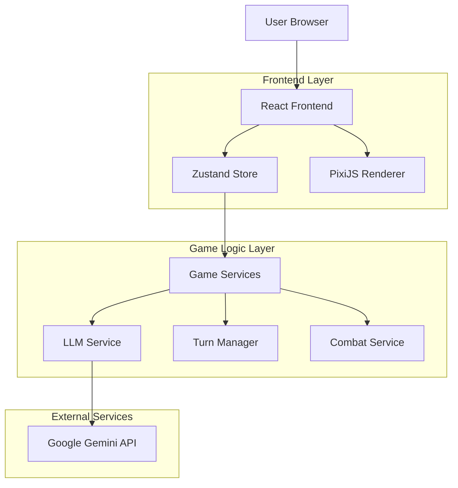
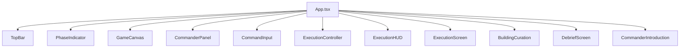
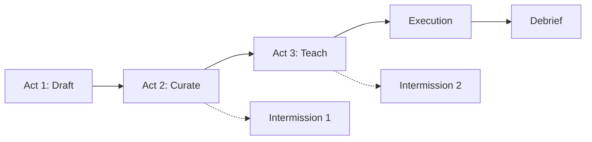
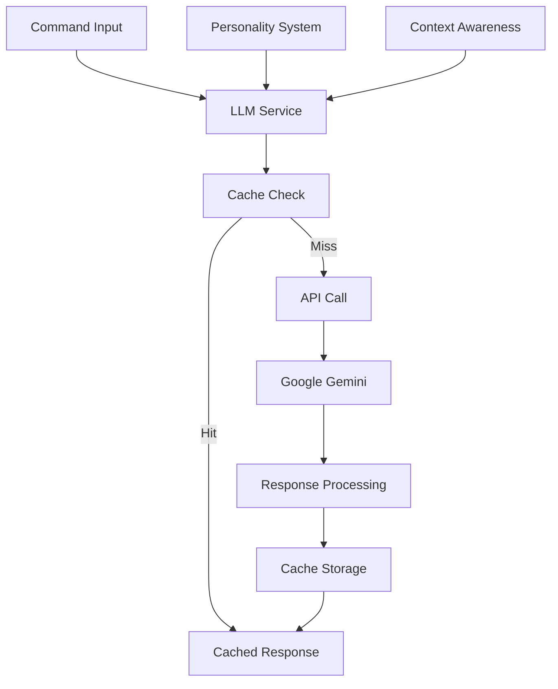
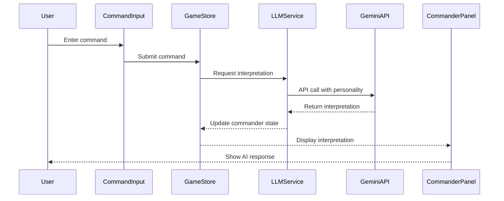
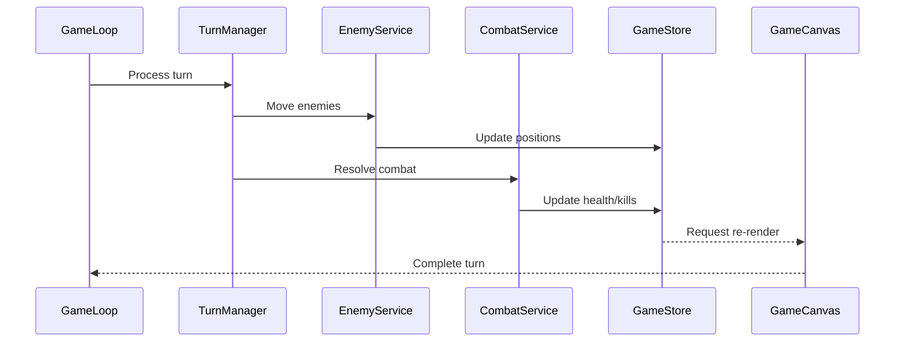

# Age of Commanders - Technical Architecture Document

## 1. System Overview

Age of Commanders is a React-based tower defense game with AI-powered commander personalities, featuring a unique 3-act gameplay structure with blind building mechanics. The game combines real-time strategy elements with LLM-driven AI interpretation systems.

### Core Architecture Components
- **Frontend**: React 19 + TypeScript + Vite
- **Rendering Engine**: PixiJS for high-performance 2D graphics
- **State Management**: Zustand for centralized game state
- **AI Integration**: Google Gemini API for commander personality interpretation
- **Build System**: Vite with React plugin and TypeScript support



## 2. Technology Stack

### Frontend Dependencies
- **React 19.1.1**: Modern React with latest features
- **TypeScript 5.9.3**: Type-safe development
- **PixiJS 8.14.0**: High-performance 2D rendering engine
- **Zustand 5.0.8**: Lightweight state management
- **Tailwind CSS 4.1.16**: Utility-first CSS framework
- **Lucide React 0.548.0**: Icon library
- **React Hot Toast 2.6.0**: Notification system

### Development Tools
- **Vite 7.1.7**: Fast build tool and dev server
- **ESLint 9.36.0**: Code linting and quality
- **TypeScript ESLint**: TypeScript-specific linting rules

## 3. Component Architecture

### Main Application Structure
The application follows a component-based architecture with centralized state management:



### Core Components

#### GameCanvas Component
- **Purpose**: Main game rendering surface using PixiJS
- **Responsibilities**: 
  - Initialize and manage PixiJS application
  - Render game grid, buildings, enemies, and effects
  - Handle camera controls (zoom, pan)
  - Manage sprite textures and animations
  - Process hover interactions and tooltips

#### CommanderPanel Component
- **Purpose**: Display AI commander information and thoughts
- **Features**:
  - Show commander avatars and personalities
  - Display interpretation history
  - Present building plans and execution status

#### CommandInput Component
- **Purpose**: User input interface for commanding AI
- **Features**:
  - Text input for commands
  - Command history
  - Personality-aware prompt suggestions

## 4. State Management Architecture

### Zustand Store Structure
The game uses a centralized Zustand store for all game state management:

```typescript
interface GameState {
  // Game progression
  phase: GamePhase;
  currentAct: 1 | 2 | 3;
  isIntermission: boolean;
  
  // Resources and economy
  wood: number;
  buildings: Building[];
  enemies: Enemy[];
  
  // AI Commanders
  commanders: Commander[];
  commanderThoughts: CommanderThought[];
  
  // Turn system
  currentTurn: number;
  maxTurns: number;
  isPaused: boolean;
  turnLog: TurnLogEntry[];
  
  // Game settings
  apiKey: string | null;
  concurrencyLimit: number;
  uiTheme: UITheme;
}
```

### State Management Patterns
- **Immutable Updates**: All state changes use immutable patterns
- **Derived State**: Computed values derived from base state
- **Action Methods**: Dedicated methods for state mutations
- **Persistence**: Local storage for API keys and cached interpretations

## 5. Game Engine Architecture

### 3-Act Gameplay System
The game implements a unique 3-act structure with escalating complexity:



#### Act 1: Draft Phase
- **Duration**: Turns 1-8
- **Mechanics**: Basic building placement with blind reveal
- **Bonus System**: Rewards for enemy kills and base protection

#### Act 2: Curate Phase
- **Duration**: Turns 9-16
- **Mechanics**: Building selection and curation
- **Bonus System**: Performance-based wood rewards

#### Act 3: Teach Phase
- **Duration**: Turns 17-24
- **Mechanics**: AI commander training and execution
- **Final Challenge**: Maximum difficulty enemy waves

### Turn Management System
The turn manager orchestrates all game logic each turn:

```typescript
export async function processTurn(): Promise<TurnResult> {
  // Phase 0: Farm Production
  processFarmProduction();
  
  // Phase 1: Enemy Spawning
  spawnEnemiesForTurn(currentTurn, currentAct);
  
  // Phase 2: Enemy Movement
  const enemyResult = await processEnemyTurn();
  
  // Phase 3: Commander Building
  await processCommanderBuilds(currentTurn);
  
  // Phase 4: Combat Resolution
  const combatResult = await processCombatPhase();
  
  return {
    enemiesKilled: combatResult.enemiesKilled,
    buildingsPlaced: buildingsPlaced,
    baseDamaged: enemyResult.baseDamaged,
    gameOver: gameOver,
    victory: victory
  };
}
```

## 6. AI Integration Architecture

### LLM Service Design
The LLM service provides AI-powered commander interpretations:



#### Personality System
Each commander has a distinct personality affecting interpretation:
- **Literalist (Larry)**: Word-for-word interpretation, robotic responses
- **Paranoid (Paul)**: Suspicious of everything, over-prepares
- **Optimist (Olivia)**: Sees friendship opportunities, positive outlook

#### Context-Aware Interpretation
The system includes game state context in AI prompts:
- Previous command history
- Current act and turn number
- Resource levels and enemy status
- Performance metrics

### Concurrency Management
- **Rate Limiting**: p-limit library controls API concurrency
- **Caching**: Local storage for interpretation responses
- **Fallback System**: Default responses when API fails

## 7. Rendering System

### PixiJS Integration
The game uses PixiJS for high-performance 2D rendering:

```typescript
// Initialize PixiJS application
const app = new Application({
  width: containerWidth,
  height: containerHeight,
  backgroundColor: COLORS.BACKGROUND,
  antialias: true,
});

// Create camera container for zoom/pan
const camera = new Container();
camera.sortableChildren = true;
app.stage.addChild(camera);

// Z-layer management
const Z_LAYERS = {
  TILES: 0,
  BASE: 1,
  BUILDINGS: 10,
  ENEMIES: 20,
  EFFECTS: 30,
} as const;
```

### Rendering Pipeline
1. **Tile Rendering**: Grass, forest, and water tiles
2. **Building Rendering**: Static building sprites with type-specific styling
3. **Enemy Rendering**: Animated enemy sprites with health bars
4. **Effect Rendering**: Combat effects, explosions, and visual feedback
5. **UI Overlay**: Thought bubbles, tooltips, and status indicators

### Performance Optimizations
- **Texture Caching**: Pre-loaded and cached building/enemy textures
- **Sprite Pooling**: Reuse sprite objects to minimize garbage collection
- **Viewport Culling**: Only render visible objects
- **Resize Observer**: Dynamic canvas resizing with performance awareness

## 8. Data Flow Architecture

### Command Processing Flow


### Turn Processing Flow


## 9. Configuration and Constants

### Game Constants Structure
```typescript
// Core game parameters
export const TILE_SIZE = 32;
export const GRID_SIZE = 26;
export const MAX_TURNS = 24;

// Building costs and properties
export const BUILDING_COSTS: Record<BuildingType, number> = {
  wall: 4,
  tower: 8,
  decoy: 5,
  mine: 6,
  farm: 10,
};

// Combat settings
export const COMBAT_SETTINGS = {
  TOWER_RANGE: 3,
  MINE_DAMAGE: 100,
  BASE_MAX_HEALTH: 3,
} as const;
```

### Theming System
- **Dark Blur Theme**: Glass morphism effects with backdrop blur
- **Color Palette**: Consistent color scheme across all UI elements
- **Responsive Design**: Adaptive layouts for different screen sizes

## 10. Error Handling and Resilience

### API Error Handling
- **Fallback Responses**: Default personality responses when API fails
- **Retry Logic**: Exponential backoff for failed API calls
- **Graceful Degradation**: Game continues without AI when API unavailable

### State Validation
- **Input Sanitization**: Clean and validate all user inputs
- **State Consistency**: Ensure game state remains valid throughout
- **Boundary Checking**: Prevent invalid positions and values

### Performance Monitoring
- **Render Performance**: Monitor PixiJS frame rates
- **Memory Management**: Track and prevent memory leaks
- **Bundle Size**: Monitor and optimize build output

## 11. Development and Build System

### Vite Configuration
```typescript
export default defineConfig({
  plugins: [react()],
  build: {
    target: 'esnext',
    minify: 'terser',
  },
  server: {
    port: 3000,
    open: true,
  },
});
```

### Development Workflow
1. **Hot Module Replacement**: Instant updates during development
2. **TypeScript Compilation**: Real-time type checking
3. **ESLint Integration**: Code quality enforcement
4. **Build Optimization**: Production-ready optimized builds

This architecture provides a robust foundation for the Age of Commanders game, combining modern web technologies with innovative AI integration to create a unique gaming experience.